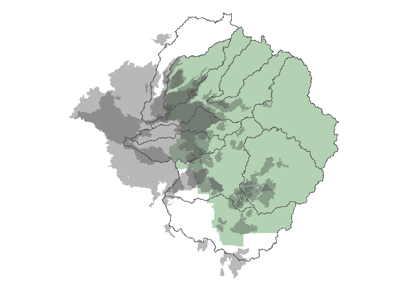
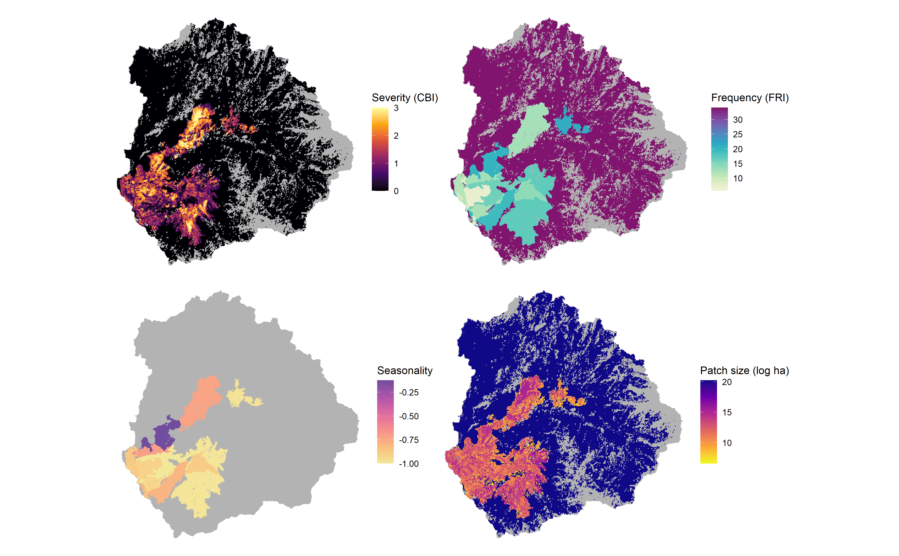
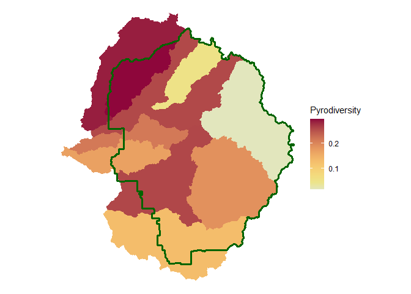

Pyrodiversity Yosemite Demo
================
Zack Steel

# Quantifying Pyrodiversity

Here I demonstrate the functionality of the
[Pyrodiversity](https://github.com/zacksteel/pyrodiversity) repository,
which is associated with the publication “Quantifying pyrodiversity and
its drivers” (coming soon to a journal near you). I will limit
calculations to the watersheds which intersect Yosemite National Park in
California’s Sierra Nevada Mountains and to moderate to large size fires
(\>404 ha) included in the Monitoring Trends in Burn Severity (MTBS)
perimeters. I use the burn perimeters from MTBS but severity is
calculated according to [Parks et
al. 2019](https://www.mdpi.com/2072-4292/11/14/1735).

All data for this demonstration are included in this repository, which
can be cloned to run on your own. Alternatively, users can apply this
code to their own fires and landscapes of interested. To do so you will
need continous composite burn index (CBI) rasters calculated using the
Parks model or another validated burn severity model.

There are three primary steps to calculating pyrodiversity: 1) Compile
comprehensive fire histories for an area of interest. 2) Generate fire
trait surfaces (rasters) using these fire history data. 3) Sample from
fire trait surfaces to calculate pyrodiversity for points or areas of
interest.

## 1\. Compile fire histories

Estimates of burn severity (and subsequently patch size) are dependent
on Landsat imagery, which first became available in 1984, as well as a
validated severity model calibrated to the region of interest. We use
the [Parks model](https://www.mdpi.com/2072-4292/11/14/1735) to estimate
severity in forest of the western United States. Other regional models
exist in areas with more limited spatial extent but more comprehensive
histories. For example, the [Koontz model](https://osf.io/ke4qj/#!)
includes California fires of at least 4 hectares that burned at least
partially in mixed conifer forests.

This fire history data must include a fire perimeter shapefile with
ignition date (Julian day), ignition year and unique fire ID, as well as
fire severity rasters (currently limited to composite burn index) that
can be associated with the perimeter shapefile using the fire ID.

*Demo: There are 10 HUC10 watersheds (black outlines) whose centroids
are within Yosemite (green polygon) and 64 fires (semi-transparent grey
polygons) that intersect those watersheds between 1985 and 2018.*

``` r
library(tidyverse)
library(sf)
library(raster)
library(stars)
library(fasterize)
library(lwgeom)
library(FD)
library(colorspace)
library(knitr)

## read in shapefiles
yose <- read_sf("data/spatial/yosemite.shp")
hucs <- read_sf("data/spatial/yose_sheds.shp")
yose_fires <- read_sf("data/spatial/yose_mtbs.shp") 

ggplot() +
  geom_sf(data = yose, fill = "darkgreen", color = NA, alpha = 0.3) +
  geom_sf(data = hucs, fill = NA) +
  geom_sf(data = yose_fires, fill = "grey30", color = NA, alpha = 0.4) +
  theme_void()
```

<!-- -->

``` r
as.data.frame(yose_fires) %>% 
  dplyr::select(Fire_ID, Fire_Name, Year, jday) %>% 
  head()
```

    ##                 Fire_ID          Fire_Name Year jday
    ## 1 CA3749911974020080621             OLIVER 2008  173
    ## 2 CA3755011992320130616           CARSTENS 2013  167
    ## 3 CA3755311966920080409          WAWONA NW 2008  100
    ## 4 CA3757311966320071029               JACK 2007  302
    ## 5 CA3759811955420160626              LAKES 2016  178
    ## 6 CA3762911959119990711 SOUTH PARK COMPLEX 1999  192

## 2\. Generate fire trait surfaces

Fire trait surfaces can be generated using the functions included in
this repository, and allow a user to define trait weights and the
importance decay rate of the “invisible mosaic” (i.e. how much less
important are fires prior to the most recent). Alternatively, 30m
resolution surfaces used in Steel et al. are available \[at a link\] for
the forested watersheds (\(>=\) 50% forest cover) of the western United
States. These surfaces use equally weighted fire traits and a importance
decay of 0.5 (recent fires receive twice the weight as the previous
fire).

*Demo: for each watershed whose centroid is within Yosemite we will
build fire trait surfaces for frequency, seasonality, severity and patch
size of each watershed. Code below can be run for all (~1hr run time) or
you can skip this block and read in pre-calculated layers in step \#3
below.*

``` r
## load functions
source("code/fri_surface.R")
source("code/season_surface.R")
source("code/sev_surface.R")
source("code/patch_surface.R")


## Frequency calculation (takes about 40 seconds)
for (i in 1:nrow(hucs)) {
    ## pull out single landscape          
    huc <- hucs[i,]
    
    fri_surface(landscape = huc, #shapefile of landsape of interest
                fires = yose_fires, #shapefile containing fire IDs associated with severity rasters
                ID = "HUC10", #label of the unique landscape identifier
                fire_years = "Year", # label of the fire year column
                start_year = 1984, # Year prior to start of dataset (for landsat: 1983)
                end_year = 2018, # Year after end of dataset (for MTBS: 2018)
                decay_rate = 0.5, # Importance decay rate of the "invisible mosaic", between [0,1)
                out_dir = "data/spatial/yose_fri") #path to hold output rasters
}


## Seasonality calculation (takes about 25 seconds)
for (i in 1:nrow(hucs)) {
    ## pull out single landscape          
    huc <- hucs[i,]
    
    season_surface(landscape = huc, #shapefile of landsape of interest
                   fires = yose_fires, #shapefile containing fire IDs associated with severity rasters
                   ID = "HUC10", #label of the unique landscape identifier
                   fire_years = "Year", # label of the fire year column
                   fire_day = "jday",
                   decay_rate = 0.5, # Importance decay rate of the "invisible mosaic", between [0,1)
                   out_dir = "data/spatial/yose_sea") #path to hold output rasters
}


## Severity and patch surface functions are much slower, consider parallel processing
## if running for large or many landscapes
## Severity calculation (takes about 4 minutes)
for (i in 1:nrow(hucs)) {
    ## pull out single landscape          
    huc <- hucs[i,]
    
    sev_surface(landscape = huc, #shapefile of landsape of interest
                fires = yose_fires, #shapefile containing fire IDs associated with severity rasters
                ID = "HUC10", #label of the unique landscape identifier
                severity_dir = "data/spatial/yose_mtbs_sev", # directory where fire rasters are held
                fire_years = "Year", # label of the fire year column
                decay_rate = 0.5, # Importance decay rate of the "invisible mosaic", between [0,1)
                out_dir = "data/spatial/yose_sev") #path to hold output rasters
}


## Patch calculation (takes about 1.1 hrs)
for (i in 1:nrow(hucs)) {
    ## pull out single landscape          
    huc <- hucs[i,]
    
    patch_surface(landscape = huc, #shapefile of landsape of interest
                  fires = yose_fires, #shapefile containing fire IDs associated with severity rasters
                  ID = "HUC10", #label of the unique landscape identifier
                  severity_dir = "data/spatial/yose_mtbs_sev", # directory where fire rasters are held
                  fire_years = "Year", # label of the fire year column
                  decay_rate = 0.5, # Importance decay rate of the "invisible mosaic", between [0,1)
                  out_dir = "data/spatial/yose_pat") #path to hold output rasters
}
```

*For illustration, here is what the four surfaces look like for the
Upper-Merced watershed, with non-vegetated areas masked out.*



## 3 Calculate pyrodviersity from surfaces

This can be done for a full landscape (e.g. a watershed) or buffered
around sample points. Here I demonstrate this for watersheds and will
add a sample point example at a later date.

``` r
## Calculate pyrodviersity for each watershed
## This block takes about an hour to run
pd <- lapply(1:nrow(hucs), function(i) {
  huc <- hucs[i,]
  id <- as.data.frame(huc)[1,"HUC10"]
  
  ## bring in trait rasters and adjust precision   
  ## E.g. Frequency - 1 year increments; Patch size - 1 log HA increments; 
  ## Severity - 0.5 CBI increments; Seasonality - 0.1 increments.
  mround <- function(x, base, digits){
        base*round(x/base, digits = digits)
      } 
  fri_r <- paste0("data/spatial/yose_fri/fri_", id, ".tif") %>% 
    raster() %>% 
    round(digits = 0)
  sea_r <- paste0("data/spatial/yose_sea/sea_", id, ".tif") %>% 
    raster() %>% 
    round(digits = 1)
  sev_r <- paste0("data/spatial/yose_sev/sev_", id, ".tif") %>% 
    raster() %>% 
    mround(base = 5, digits = 1)
  pat_r <- paste0("data/spatial/yose_pat/pat_", id, ".tif") %>% 
    raster() %>% 
    round(digits = 0)
  
  ## Bring in mask raster
  flam_r <- paste0("data/spatial/yose_flam/flam_", id, ".tif") %>% 
    raster()

source("code/pyrodiv_calc.R")
d <- pyrodiv_calc(traits = c(fri_r, sea_r, sev_r, pat_r), #vector of paths to trait rasters 
                  mask = flam_r #optional mask layer path (e.g. remove non-flammable areas)
             )
return(d)
}) %>% 
  bind_rows()

write.csv(pd, "data/yose_pyrodiv.csv", row.names = F)
```

``` r
pd <- read.csv("data/yose_pyrodiv.csv")

hucs2 <- bind_cols(hucs, pd)

ggplot() +
  geom_sf(data = hucs2, aes(fill = FDis), color = NA) +
      scale_fill_continuous_sequential(palette = "Heat",
                                     name = "Pyrodiversity") +
  geom_sf(data = yose, fill = NA, color = "darkgreen", size = 1.25) +
  theme_void()
```

<!-- -->
